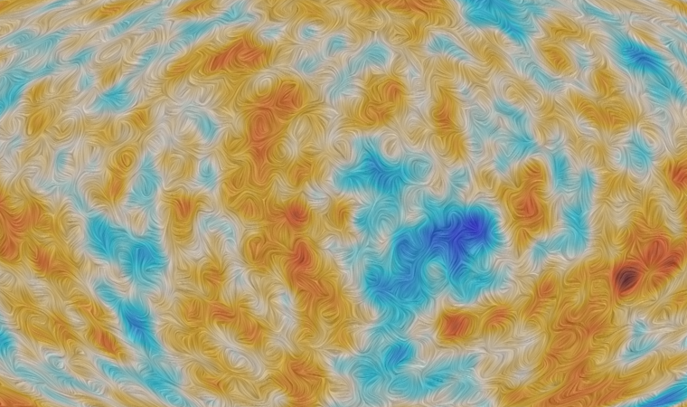

<!---->

I am a cosmologist, working as a PhD student at the Instituto de Física de Cantabria in Santander, Spain. My research is focused on the analysis of the <a href="https://en.wikipedia.org/wiki/Cosmic_microwave_background" style="color: #2ecc71"> Cosmic Microwave Background  </a>. On this website, you can find information and useful links related to my research:

- For more information about me, see the [**About me**]({{ site.url }}/about/) page.

- A detailed description of my research interests is provided in the [**Research interests**]({{ site.url }}/research/) page.
- The [**Publications**]({{ site.url }}/publications/) page displays in reverse chronological order my journal publications.

- My talks and seminars are listed on the [**Talks**]({{ site.url }}/talks/) page. 

- The [**Teaching**]({{ site.url }}/teaching/) page contains the information regarding the courses that I have taught as well as the master theses that I co-directed. 

- In [**Outreach**]({{ site.url }}/outreach/) you can find photos and videos from outreach activities I participated in.
